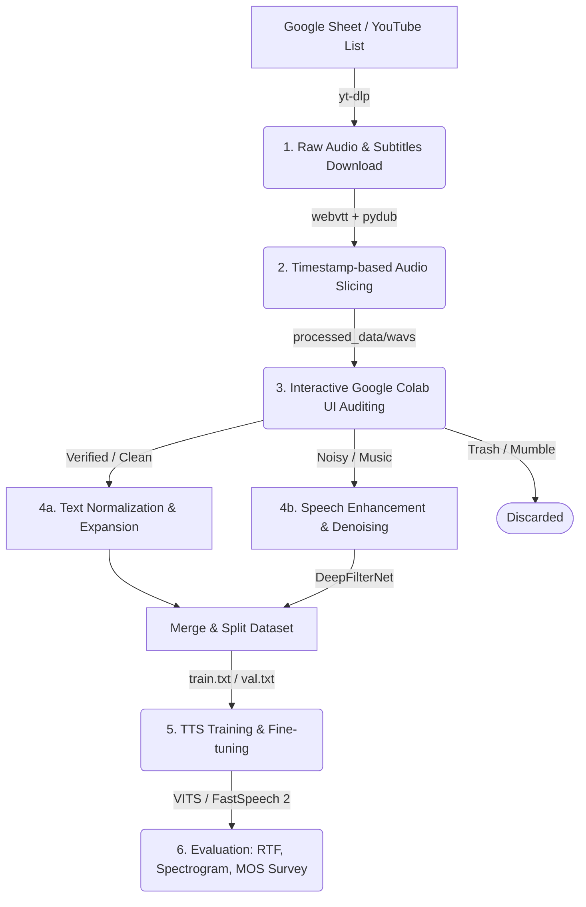

# Vietnamese Speech Enhancement & Neural Text-to-Speech (TTS) Pipeline

A complete end-to-end repository for gathering datasets "in-the-wild" (YouTube), slicing, annotating via interactive UI, expanding text, cleaning environmental noise via Deep Learning / DSP models, and training/fine-tuning state-of-the-art Neural TTS systems (**VITS** and **FastSpeech 2**).

This project was built to address the extreme scarcity of clean Vietnamese studio speech corpora by scraping public audio resources and enhancing speech quality to studio-like standards automatically.

---

## 🏗️ Architecture Overview

The speech processing and TTS pipeline works as a sequence of modular processing steps:



---

## 📁 Repository Directory Structure

```
ttcs/
├── README.md                  # Main project introduction & CLI reference
├── TRAINING_GUIDE.md          # Step-by-step training and fine-tuning tutorial
├── requirements.txt           # Python dependency file
├── data_pipeline/             # Dataset collection and preprocessing
│   ├── downloader.py          # yt-dlp video & subtitle downloader
│   ├── slicer.py              # webvtt subtitle parser & pydub audio segment slicer
│   ├── annotator_ui.ipynb     # Jupyter/Colab notebook with interactive annotation UI (ipywidgets)
│   ├── merge_and_split.py     # Merges all CSV files in a folder and splits train/val
│   ├── normalizer.py          # Regex & num2words text normalizer
│   └── g2p.py                 # Vietnamese Grapheme-to-Phoneme converter (viphoneme wrapper & rules)
├── denoising/                 # Audio quality improvement / Speech Enhancement
│   ├── deepfilter.py          # DeepFilterNet integration wrapper
│   ├── noisereduce_dsp.py     # noisereduce (DSP Spectral Gating) script
│   ├── rnnoise_wrapper.py     # RNNoise wrapper (mock/native wrapper)
│   └── spleeter_wrapper.py    # Spleeter stem separator wrapper
├── models/                    # TTS model definitions and wrappers
│   ├── vits/
│   │   ├── model.py           # Core VITS architecture definitions
│   │   ├── train.py           # Fine-tuning and training loop for VITS
│   │   ├── inference.py       # Text synthesis and inference script
│   │   ├── dataset.py         # PyTorch Dataset for loading audio/text pairs
│   │   └── utils.py           # VITS helper utilities (transforms, audio processing)
│   └── fastspeech2/
│       ├── train_fs2.py       # Wrapper training pipeline for FastSpeech 2
│       └── inference_fs2.py   # FastSpeech 2 + HiFi-GAN inference wrapper
├── configs/                   # Hyperparameters configurations
│   ├── vits_config.json       # VITS training config (sample rate, model hyperparameters)
│   └── fs2_config.json        # FastSpeech 2 config
└── benchmarks/                # Performance assessment utilities
    ├── benchmark_denoise.py   # Script measuring RTF, Peak RAM, and audio artifacts
    ├── spectrogram_plotter.py # Librosa & Matplotlib script for side-by-side spectrograms
    └── mos_survey.py          # Terminal-based evaluation utility for Mean Opinion Score
```

---

## ⚙️ Installation & Setup

### Prerequisites
* **Python**: `python >= 3.8`
* **System Utilities**: **FFmpeg** must be installed and added to your system's PATH variables (crucial for `pydub` slicing and audio resampling).
  * *Windows (PowerShell)*: `winget install FFmpeg`
  * *Linux (Ubuntu/Colab)*: `sudo apt-get install ffmpeg`

### Python Packages Installation
Clone the repository and install all dependencies:
```bash
pip install -r requirements.txt
```

*Note: If training models on CUDA GPU, install PyTorch beforehand matching your local CUDA toolkit version:*
```bash
pip install torch torchvision torchaudio --index-url https://download.pytorch.org/whl/cu118
```

---

## 🚀 Execution Guide

For a detailed step-by-step training walkthrough after collecting data, please consult [TRAINING_GUIDE.md](file:///c:/code/ttcs/TRAINING_GUIDE.md).

### 1. Data Collection & Slicing
Download audio and manual subtitles (.vtt) from a list of YouTube URLs:
```bash
python data_pipeline/downloader.py --urls "https://www.youtube.com/watch?v=VIDEO_ID" --output_dir raw_data
```
Or download from a txt list containing one URL per line:
```bash
python data_pipeline/downloader.py --file list.txt --output_dir raw_data
```

Slice raw audio files into short sentences (~1 to 15 seconds) based on subtitle timestamps:
```bash
python data_pipeline/slicer.py --raw_dir raw_data --output_dir processed_data --padding 100
```

### 2. Dataset Annotation & Curation
Upload the folder `processed_data/` to Google Drive or OneDrive, and run `data_pipeline/annotator_ui.ipynb` in Google Colab to access the interactive GUI.
* **Chuẩn (Save)**: Records clean speech to `metadata_verified.csv`.
* **Ồn (Denoise)**: Moves clips to `wavs_need_denoise/` and text log to `metadata_noise.csv`.
* **Rác (Trash)**: Discards stutter/mumble clips into `wavs_trash/`.
* **Hoàn tác (Undo)**: Reverts the last action, restoring audio file positions and removing CSV logging entries automatically.

### 3. Merging and Splitting Dataset
Once annotation is complete, run the merger to combine multiple CSV sheets (from team members A and B chẵn/lẻ annotations) and generate training validation text indices:
```bash
python data_pipeline/merge_and_split.py --input_dir processed_data --output_dir processed_data --split_ratio 0.95
```
This generates:
* `processed_data/final_metadata.csv` (All unique annotated rows combined)
* `processed_data/train.txt` (95% shuffled train records formatted as `audio_path|text`)
* `processed_data/val.txt` (5% validation records)

### 4. Denoising / Speech Enhancement
Run denoising batch models on raw audio samples located in `processed_data/wavs_need_denoise/`:

* **DeepFilterNet (Selected AI)**:
  ```bash
  python denoising/deepfilter.py --input_dir processed_data/wavs_need_denoise --output_dir processed_data/wavs_denoised
  ```
* **noisereduce (DSP Baseline)**:
  ```bash
  python denoising/noisereduce_dsp.py --input_dir processed_data/wavs_need_denoise --output_dir processed_data/wavs_noisereduce
  ```
* **RNNoise**:
  ```bash
  python denoising/rnnoise_wrapper.py --input_dir processed_data/wavs_need_denoise --output_dir processed_data/wavs_rnnoise
  ```
* **Spleeter (Vocal Isolation)**:
  ```bash
  python denoising/spleeter_wrapper.py --input_dir processed_data/wavs_need_denoise --output_dir processed_data/wavs_spleeter
  ```

---

## 📊 Evaluation & Benchmarking Utilities

### 1. Denoising Performance Benchmark
To measure execution speeds (Real-Time Factor - RTF) and peak VRAM/RAM overhead of all four denoising tools side-by-side:
```bash
python benchmarks/benchmark_denoise.py --input_dir processed_data/wavs_need_denoise --output_root processed_data/benchmarks
```
Outputs a detailed Markdown comparison report and saves data to `benchmark_report.csv`.

### 2. Spectrogram Extraction
Create side-by-side high-resolution spectral graphs to visualize background noise removal (useful for report appendices):
```bash
python benchmarks/spectrogram_plotter.py --before path/to/noisy.wav --after path/to/cleaned.wav --output outputs/spectrogram_comparison.png
```

### 3. Mean Opinion Score (MOS) Survey Tool
Evaluate the naturalness, clarity, and audio quality of synthesized voices by conducting blind tests with classmates:
```bash
python benchmarks/mos_survey.py --audio_dir outputs/eval_samples --output outputs/mos_results.csv
```
This utility plays randomized blind audio files, records 1-5 ratings from listeners, and prints real-time running mean stats.

---

## 🤖 Neural Text-to-Speech Training & Inference

### Training VITS End-to-End
Start training VITS model from scratch or fine-tune from pre-trained weights:
```bash
python models/vits/train.py --config configs/vits_config.json --train_list processed_data/train.txt --val_list processed_data/val.txt --output_dir checkpoints --epochs 100 --batch_size 8
```
To resume training or **fine-tune** on your custom dataset:
```bash
python models/vits/train.py --resume checkpoints/vits_latest.pth --config configs/vits_config.json --epochs 150
```

### Inference / Synthesizing custom Vietnamese sentences
```bash
python models/vits/inference.py --text "Hôm nay tôi muốn thử nghiệm hệ thống chuyển đổi văn bản thành giọng nói." --checkpoint checkpoints/vits_latest.pth --output outputs/synthesized_vietnamese.wav
```
This automatically invokes the `data_pipeline/normalizer.py` script to format text numbers and abbreviations correctly before synthesis.
