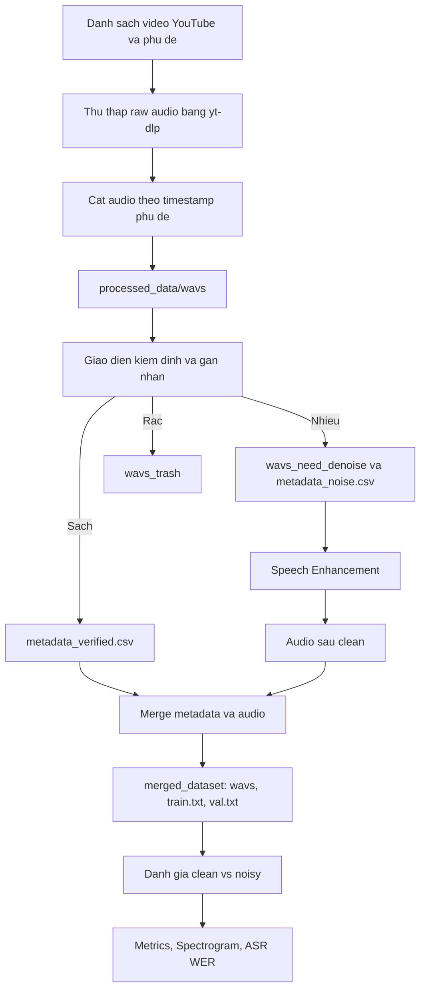

# Bao cao cac noi dung can sua trong `ttcs_pipeline bao cao.md`

## 1. Van de lon nhat: can doi lai trong tam de tai

Ban bao cao hien tai van viet theo huong:

- Xay dung he thong TTS tieng Viet.
- So sanh cac model TTS nhu VITS va FastSpeech 2.
- Ap dung DeepFilterNet vao TTS training.

Trong khi ket qua thuc nghiem hien tai cua nhom dang phu hop hon voi huong:

> Xay dung pipeline thu thap va lam sach du lieu tieng noi tieng Viet tu nguon thuc te co nhieu nen, sau do danh gia tac dong cua buoc xu ly nhieu doi voi chat luong du lieu dau vao cho TTS.

Can sua lai muc tieu bao cao de tranh hua qua nhieu ve viec train TTS. Phan TTS nen duoc dat la dong luc ung dung va huong su dung du lieu sau clean, khong phai ket qua chinh.

## 2. Can sua loi encoding tieng Viet

File hien tai bi loi font/encoding rat nang, vi du:

- `ChÆ°Æ¡ng`
- `tạp âm`
- `mở đầu`
- `Giới thiệu`

Can chuyen file ve UTF-8 dung chuan va sua lai dau tieng Viet. Neu de nguyen, bao cao se kho doc va mat tinh chuyen nghiep.

Viec can lam:

- Mo file bang editor ho tro UTF-8.
- Neu noi dung goc da bi mojibake, can copy lai tu nguon dung hoac sua lai bang tay cac tieu de/chuyen muc.
- Thong nhat cach go: `nhiễu`, `tạp âm`, `dữ liệu`, `mô hình`, `huấn luyện`, `đánh giá`.

## 3. Can xoa hoac chuyen phan nhap/ghi chu thanh noi dung chinh thuc

Dau file con nhieu dong dang note noi bo, chua phai van phong bao cao:

- `chưa chạy code đếm số giờ âm thanh`
- `maybe`
- `cái này cho qua mermaid to image`
- `tạm thời phần này chưa làm tới`
- `insert ảnh chụp code`

Can xoa cac ghi chu nay hoac bien thanh noi dung hoan chinh.

De xuat:

- Tach phan note noi bo ra file rieng.
- Trong bao cao chinh chi giu noi dung da co so lieu va ket qua.

## 4. Can sua phan muc tieu cua de tai

Muc tieu hien tai co noi:

> Ap dung du lieu da lam sach vao viec huan luyen cac kien truc TTS khac nhau...

Can sua lai vi nhom chua co ket qua TTS tot. Nen viet thanh:

> De tai tap trung xay dung pipeline xu ly du lieu tieng noi co nhieu nen, danh gia muc do cai thien cua du lieu sau khi lam sach bang cac chi so am hoc va kha nang nhan dang tu dong. Du lieu sau xu ly duoc dinh huong su dung cho cac bai toan TTS tieng Viet.

Nen chia muc tieu thanh:

1. Thu thap va cat nho du lieu tieng noi tu video YouTube co phu de.
2. Gan nhan va phan loai audio thanh nhom sach, nhieu va rac.
3. Ap dung phuong phap lam sach nhieu nen cho cac mau audio bi nhieu.
4. Danh gia truoc/sau bang noise floor, estimated SNR, spectrogram va ASR WER.
5. Phan tich vai tro cua du lieu sach doi voi bai toan TTS.

## 5. Can dieu chinh phan ly thuyet ve model

### 5.1. Phan Speech Enhancement

Bang so sanh DeepFilterNet, noisereduce, RNNoise, Spleeter co the giu, nhung can viet trung tinh hon.

Can tranh cac cum qua cam tinh/chua hoc thuat:

- `Sieu nang luc`
- `Yeu diem chi mang`
- `vat te than`
- `triet tieu hoan toan`

Nen sua thanh:

- Uu diem
- Han che
- Vai tro trong thuc nghiem
- Phu hop voi loai nhieu nao

Can ghi ro:

- DeepFilterNet duoc chon cho pipeline chinh.
- noisereduce/RNNoise/Spleeter co the la baseline hoac phan tham khao neu co chay so sanh.
- Neu chua benchmark day du 4 model thi khong nen ket luan "DeepFilterNet toi uu nhat" mot cach tuyet doi.

### 5.2. Phan TTS

Phan VITS va FastSpeech 2 hien tai dang viet nhu se so sanh hai model TTS. Neu khong co ket qua train/inference tot thi can ha muc do cam ket.

Nen viet:

> VITS va FastSpeech 2 duoc trinh bay nhu cac kien truc TTS tieu bieu de giai thich vi sao du lieu dau vao can sach. Trong pham vi thuc nghiem hien tai, nhom tap trung danh gia chat luong du lieu sau tien xu ly thay vi so sanh chat luong dau ra cua cac model TTS.

Can them phan han che:

- Link checkpoint pre-trained bi loi 401 Unauthorized.
- Train from scratch cho ket qua audio chua dat yeu cau.
- Do do, TTS training chi duoc xem la huong phat trien/thu nghiem phu.

## 6. Can bo sung ket qua thuc nghiem da co

Bao cao hien tai con noi benchmark "chua lam toi", trong khi nhom da co cac file:

- `summary_metrics.csv`
- `clean_vs_noisy_metrics.csv`
- `another_metrics.csv`
- `asr_evaluation_report.csv`
- `spectrogram_comparison_report.png`

Can bo sung vao chuong thuc nghiem.

### 6.1. Ket qua tong hop tu `summary_metrics.csv`

Bang nen dua vao bao cao:

| Chi so | Tap goc/noisy | Tap sau xu ly/clean | Muc cai thien |
| --- | ---: | ---: | ---: |
| RMS | 0.0918 | 0.0881 | -0.0037 |
| Peak Amplitude | 0.8011 | 0.7883 | -0.0128 |
| Noise Floor (dB) | -32.85 | -40.97 | -8.12 dB |
| Estimated SNR (dB) | 20.43 | 29.63 | +9.20 dB |

Nhan xet can viet:

> Sau khi xu ly, noise floor trung binh giam khoang 8.12 dB, trong khi estimated SNR tang khoang 9.20 dB. Dieu nay cho thay thanh phan nhieu nen duoc giam dang ke, giup tin hieu giong noi noi bat hon trong ban ghi.

### 6.2. Ket qua tung file tu `clean_vs_noisy_metrics.csv`

Da doc duoc:

- So cap audio: 100.
- SNR improvement trung binh: +9.20 dB.
- SNR improvement nho nhat: +3.75 dB.
- SNR improvement lon nhat: +30.21 dB.

Nhan xet:

> Tat ca cac mau trong tap danh gia deu co SNR improvement duong, cho thay phuong phap lam sach giup cai thien chat luong tin hieu mot cach nhat quan tren tap thu nghiem nay.

### 6.3. Ket qua bo `another_metrics.csv`

Da doc duoc:

- So cap audio: 100.
- SNR improvement trung binh: +5.16 dB.
- SNR improvement nho nhat: +0.27 dB.
- SNR improvement lon nhat: +25.32 dB.

Can hoi ro day la tap nao. Neu la tap thu nghiem thu hai, co the dua vao bao cao nhu sau:

> Tren tap thu nghiem thu hai, SNR trung binh tang 5.16 dB. Muc cai thien thap hon tap thu nhat, cho thay hieu qua lam sach phu thuoc vao loai nhieu, cuong do nhieu va noi dung audio ban dau.

### 6.4. Ket qua ASR tu `asr_evaluation_report.csv`

Bao cao hien co:

| He thong kiem chung | WER tap nhieu | WER tap sach | Cai thien |
| --- | ---: | ---: | --- |
| OpenAI Whisper ASR | 15.62% | 0.00% | Giam 15.62% loi nhan dang |

Nhan xet can viet:

> Viec WER giam tu 15.62% xuong 0.00% cho thay audio sau khi clean khong chi tot hon ve mat chi so tin hieu, ma con ro hon doi voi he thong nhan dang tieng noi tu dong. Day la bang chung quan trong cho thay du lieu sau xu ly phu hop hon de dung lam dau vao cho cac bai toan TTS va xu ly ngon ngu noi.

Can luu y:

- Neu tap ASR co it mau, phai ghi ro so mau.
- Neu transcript goc duoc lay tu subtitle, can noi do la van ban tham chieu.

## 7. Can bo sung mo ta phuong phap danh gia

Hien bao cao chua noi ro cach tinh cac chi so. Can them mot muc "Phuong phap danh gia".

Noi dung nen co:

### Estimated SNR

Do khong co ban ghi phong thu lam ground truth, nhom su dung SNR uoc luong dua tren muc nang luong khung am thanh:

- Noise floor: lay percentile thap cua RMS theo frame.
- Speech level: lay percentile cao cua RMS theo frame.
- Estimated SNR: ty le giua speech level va noise floor theo don vi dB.

Can ghi ro day la SNR uoc luong, khong phai SNR tham chieu tuyet doi.

### Noise Floor

Noise floor dai dien cho nen am thanh o cac doan nang luong thap. Gia tri cang thap sau clean cho thay nhieu nen duoc giam.

### Spectrogram

Spectrogram dung de quan sat truc quan su thay doi nang luong theo thoi gian va tan so. Sau clean, cac dai nhieu nen ky vong se mo/yeu hon, trong khi vung tan so cua giong noi duoc bao toan.

### ASR WER

WER duoc dung nhu chi so gian tiep ve do ro loi noi. Neu audio sau clean co WER thap hon, dieu do cho thay noi dung loi noi duoc nhan dang de hon.

## 8. Can sua pipeline Mermaid

Doan Mermaid hien tai bi viet tren mot dong va bi escape ky tu, rat kho render.

Nen thay bang:



Neu bao cao van muon lien he voi TTS, them nut:

```mermaid
L --> O[Dau vao tiem nang cho huan luyen TTS]
```

## 9. Can bo sung thong ke dataset

Trong bao cao hien co dong:

> du lieu gom ... gio am thanh

Can thay bang so lieu that:

- Tong so file trong `merged_dataset/wavs`.
- Tong thoi luong audio.
- So dong `train.txt`.
- So dong `val.txt`.
- So file noisy-clean duoc dung trong thuc nghiem.

Neu chua co, can chay script thong ke bang `soundfile` hoac `librosa`.

Bang nen co:

| Hang muc | Gia tri |
| --- | ---: |
| Tong so audio sau clean | ... |
| Tong thoi luong | ... gio |
| So mau train | ... |
| So mau validation | ... |
| So cap noisy-clean danh gia | 100 hoac 200 |

## 10. Can bo sung hinh anh spectrogram

File `spectrogram_comparison_report.png` nen duoc dua vao chuong thuc nghiem.

Can viet caption:

> Hinh X. So sanh pho am truoc va sau khi xu ly nhieu. Sau khi clean, nang luong nhieu nen o cac vung khong loi noi giam ro ret, trong khi cau truc pho cua tieng noi van duoc bao toan.

Neu hinh gom nhieu cap, can chu thich tung cap.

## 11. Can sua ket luan

Ket luan hien tai noi ve viec chon model cho tung use case va so sanh TTS, nhung ket qua thuc te nen ket luan ve pipeline clean data.

De xuat ket luan:

> De tai da xay dung duoc quy trinh thu thap, cat nho, gan nhan va lam sach du lieu tieng noi tieng Viet tu nguon video thuc te. Ket qua danh gia cho thay buoc xu ly nhieu giup noise floor giam trung binh 8.12 dB va estimated SNR tang trung binh 9.20 dB tren tap thu nghiem chinh. Ngoai ra, WER cua Whisper giam tu 15.62% xuong 0.00%, cho thay tin hieu loi noi sau clean ro hon doi voi he thong nhan dang tu dong. Cac ket qua nay chung minh vai tro quan trong cua tien xu ly nhieu trong qua trinh xay dung du lieu dau vao cho TTS tieng Viet.

Phan han che:

- Chua co ground truth studio de tinh SNR chuan.
- Tap danh gia ASR can ghi ro so luong mau.
- Chua train thanh cong TTS chat luong cao do thieu checkpoint pre-trained va han che cua implementation VITS hien tai.
- Dataset thu thap tu YouTube co the con nhieu ten rieng, subtitle sai, chat luong mic khong dong nhat.

Huong phat trien:

- Mo rong tap danh gia voi nhieu nguon nhieu khac nhau.
- Them MOS survey voi nguoi nghe.
- Su dung framework TTS chuan hon va checkpoint pre-trained hop le de so sanh TTS train tren noisy vs clean dataset.

## 12. De xuat cau truc bao cao sau khi sua

### Loi mo dau

Gioi thieu TTS tieng Viet, van de khan hiem du lieu sach, ly do can clean noise.

### Chuong 1. Tong quan de tai

- Ly do chon de tai.
- Muc tieu.
- Pham vi.
- Dong gop chinh.

### Chuong 2. Co so ly thuyet

- Tin hieu audio, STFT, spectrogram, Mel-scale.
- Speech enhancement.
- Vai tro cua du lieu sach trong TTS.
- Gioi thieu ngan gon VITS/FastSpeech 2 nhu boi canh, khong dat lam ket qua chinh.

### Chuong 3. Pipeline xay dung va lam sach du lieu

- Thu thap YouTube/phu de.
- Cat audio.
- Gan nhan clean/noisy/trash.
- Denoise.
- Merge dataset.
- Thong ke dataset.

### Chuong 4. Thuc nghiem va danh gia

- Thiet lap thuc nghiem noisy vs clean.
- Metrics: RMS, peak, noise floor, estimated SNR.
- Bang tong hop ket qua.
- Spectrogram.
- ASR WER.
- Neu co: MOS survey.

### Chuong 5. Ket luan va huong phat trien

- Tong ket ket qua.
- Han che.
- Huong phat trien sang TTS training chuan.

## 13. Checklist sua bao cao

- [ ] Sua loi encoding tieng Viet trong toan bo file.
- [ ] Xoa cac note noi bo/chua hoan thanh.
- [ ] Doi muc tieu tu "so sanh TTS model" sang "danh gia clean noise cho du lieu TTS".
- [ ] Giu TTS nhu boi canh va ung dung, khong phai ket qua chinh.
- [ ] Them bang summary metrics.
- [ ] Them ket qua 100 cap audio cua `clean_vs_noisy_metrics.csv`.
- [ ] Giai thich `another_metrics.csv` la tap thu nghiem nao.
- [ ] Them ket qua ASR WER.
- [ ] Chen anh spectrogram.
- [ ] Them mo ta cach tinh noise floor va estimated SNR.
- [ ] Them thong ke dataset: so file, so gio, train/val.
- [ ] Sua Mermaid pipeline.
- [ ] Sua ket luan theo ket qua clean noise.
- [ ] Them han che ve pre-trained TTS va implementation VITS.

