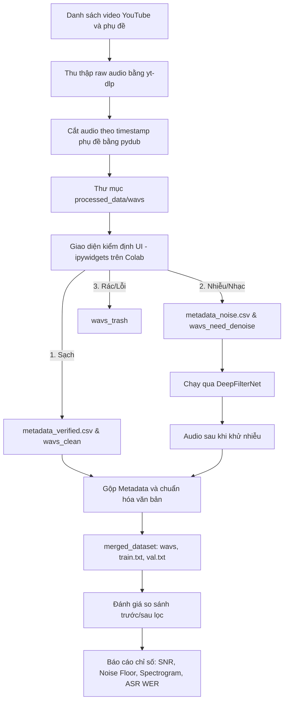

# BÁO CÁO NGHIÊN CỨU: XÂY DỰNG PIPELINE XỬ LÝ VÀ ĐÁNH GIÁ HIỆU QUẢ LỌC NHIỄU DỮ LIỆU GIỌNG NÓI TIẾNG VIỆT CHO HỆ THỐNG TTS

### **LỜI MỞ ĐẦU**

Trong bối cảnh trí tuệ nhân tạo (AI) đang thay đổi cách thức con người tương tác với công nghệ, việc xây dựng các hệ thống giao tiếp bằng giọng nói tự nhiên trở thành một yêu cầu thiết yếu. Nhận thức được tầm quan trọng đó, nhóm đã thực hiện đề tài nghiên cứu phương pháp xử lý dữ liệu tiếng nói tiếng Việt, tập trung vào việc làm sạch và nâng cao chất lượng nguồn dữ liệu âm thanh thực tế phục vụ cho các mô hình Text-To-Speech (TTS).

Trong thực tế, việc thu thập dữ liệu phòng thu vô cùng khan hiếm và tốn kém. Do đó, nhóm quyết định đi sâu vào giải quyết bài toán xử lý tạp âm từ các nguồn dữ liệu thực tế (in-the-wild) trên Internet để phục vụ cho việc chuẩn bị dữ liệu huấn luyện. Báo cáo này trình bày quy trình xây dựng pipeline xử lý dữ liệu tự động kết hợp kiểm định thủ công, đồng thời đánh giá hiệu năng thực tế của mô hình lọc nhiễu DeepFilterNet thông qua các chỉ số âm học và mô hình nhận dạng tiếng nói tự động (ASR).

---

### **PHẦN 1 – GIỚI THIỆU ĐỀ TÀI**

#### **1.1 – Tính cấp thiết và lý do chọn đề tài**
Công nghệ Chuyển đổi văn bản thành giọng nói (TTS) tiếng Việt đóng vai trò cốt lõi trong nhiều ứng dụng như sách nói, trợ lý ảo và lồng tiếng tự động. Tuy nhiên, thách thức lớn nhất để huấn luyện một mô hình TTS chất lượng cao là yêu cầu về nguồn dữ liệu âm thanh cực kỳ sạch và đồng nhất. 

Trong thực tế, việc thu thập dữ liệu phòng thu rất tốn kém và khó mở rộng quy mô. Nguồn dữ liệu dồi dào nhất hiện nay (như video YouTube, Podcast) lại thường đi kèm với tạp âm môi trường hoặc nhạc nền. Nếu đưa trực tiếp dữ liệu này vào huấn luyện, mô hình TTS sẽ học lẫn cả tạp âm, dẫn đến âm thanh đầu ra bị rè, nhiễu hoặc méo tiếng. Do đó, việc xây dựng một pipeline tự động thu thập và làm sạch nguồn dữ liệu thực tế này là vô cùng cấp thiết, giúp giảm thiểu chi phí và nâng cao tính khả thi khi triển khai các hệ thống TTS.

#### **1.2 – Mục tiêu của đề tài**
Đề tài tập trung vào việc thiết lập quy trình tiền xử lý dữ liệu thô và đánh giá định lượng hiệu quả lọc nhiễu trước và sau khi làm sạch. Cụ thể:
1. **Xây dựng Pipeline xử lý dữ liệu:** Thiết kế và triển khai quy trình bán tự động để thu thập, bóc tách và phân loại dữ liệu âm thanh từ YouTube.
2. **Lọc nhiễu dữ liệu:** Sử dụng mô hình DeepFilterNet để làm sạch các phân đoạn âm thanh bị lẫn tạp âm và nhạc nền.
3. **Đánh giá và so sánh dữ liệu:** Đo lường sự thay đổi của chất lượng âm thanh trước và sau khi lọc nhiễu thông qua các chỉ số âm học khách quan (Estimated SNR, Noise Floor, RMS, Peak Amplitude) và kiểm chứng hiệu năng nhận dạng từ đầu cuối (ASR Word Error Rate).
4. **Phân tích vai trò đối với TTS:** Đưa ra định hướng ứng dụng tập dữ liệu sau khi làm sạch vào các kiến trúc mô hình TTS hiện đại (như VITS và FastSpeech 2).

#### **1.3 – Đối tượng và phạm vi nghiên cứu**
* **Đối tượng nghiên cứu:** Các thuật toán xử lý và nâng cao chất lượng âm thanh (Speech Enhancement) bằng Deep Learning, cùng các phương pháp đánh giá chất lượng tín hiệu.
* **Phạm vi nghiên cứu:** Tập trung khai thác dữ liệu video tiếng Việt từ nền tảng YouTube có phụ đề chuẩn nhưng âm thanh bị lẫn tạp âm hoặc nhạc nền nhẹ.

---

### **PHẦN 2 – CƠ SỞ LÝ THUYẾT VÀ CÁC MÔ HÌNH XỬ LÝ**

#### **2.1. Lý thuyết cơ sở về xử lý âm thanh kỹ thuật số**
Trước khi đưa vào các thuật toán lọc nhiễu hay mô hình TTS, tín hiệu âm thanh thô (raw waveform) cần được biểu diễn dưới dạng toán học phù hợp:
* **STFT (Short-Time Fourier Transform):** Tín hiệu âm thanh dạng sóng được chia cắt thành các khung nhỏ đan xen nhau, sau đó áp dụng biến đổi Fourier để chuyển từ miền thời gian sang miền tần số, tạo ra Phổ đồ (Spectrogram).
* **Thang đo Mel và Mel-Spectrogram:** Do tai người cảm nhận tần số theo thang phi tuyến tính (nhạy bén hơn với tần số thấp), thang đo Mel được thiết kế để mô phỏng cơ chế nghe này. Việc áp dụng bộ lọc Mel lên Spectrogram sẽ tạo ra Mel-Spectrogram, là định dạng đặc trưng cốt lõi cho các bài toán xử lý giọng nói hiện đại.

#### **2.2. Phân tích các mô hình lọc tạp âm (Speech Enhancement)**
Để làm sạch dữ liệu, nhóm đã nghiên cứu các nhóm thuật toán phổ biến:
* **DeepFilterNet (Mô hình lựa chọn):** Kiến trúc học sâu (Deep Learning) tối ưu hóa việc khử nhiễu với độ trễ cực thấp. Nó chia phổ âm thành hai luồng xử lý: Dải tần thấp được phân tích với độ phân giải cao nhằm bảo toàn âm sắc giọng nói, dải tần cao được gộp theo dải ERB (Equivalent Rectangular Bandwidth) để giảm tải tính toán. Sự kết hợp này giúp triệt tiêu nhiễu nền hiệu quả mà không gây méo tiếng.
* **noisereduce (Baseline truyền thống):** Sử dụng thuật toán DSP Spectral Gating. Phương pháp này ước lượng "Noise Profile" từ một đoạn nhiễu mẫu rồi trừ trực tiếp dải tần nhiễu đó ra khỏi toàn bộ file. Dù chạy rất nhanh và không tốn tài nguyên GPU, nó dễ gây ra hiện tượng méo tiếng, tạo ra ảo âm giống giọng robot (musical noise) khi lọc mạnh.
* **RNNoise:** Kết hợp giữa xử lý tín hiệu số truyền thống và mạng RNN nhỏ gọn để dự đoán hệ số khuếch đại (Gain) cần thiết nhằm giảm nhiễu. Mô hình này rất nhẹ, chuyên dụng cho real-time nhưng khả năng khử các loại nhạc nền phức tạp còn hạn chế.
* **Spleeter:** Mô hình tách nguồn âm thanh (Source Separation) dựa trên kiến trúc U-Net. Spleeter rất mạnh trong việc tách nhạc cụ và giọng hát (Vocal/Accompaniment), nhưng dễ gây rò rỉ âm thanh (bleeding) hoặc cắt lẹm vào các âm gió của người nói thông thường.

#### **2.3. Vai trò của dữ liệu sạch đối với hệ thống TTS**
Mặc dù mục tiêu cốt lõi của đề tài này là tiền xử lý và đánh giá dữ liệu, chất lượng của dữ liệu sau lọc nhiễu đóng vai trò quyết định đối với các kiến trúc TTS:
* **Kiến trúc VITS:** VITS (Variational Autoencoder kết hợp GAN) là mô hình chuyển đổi trực tiếp từ văn bản ra sóng âm (End-to-End). Do cơ chế học tự động các biến tiềm ẩn biểu diễn cảm xúc và nhịp điệu, nếu dữ liệu đầu vào chứa nhiều tạp âm, mô hình sẽ học cả tạp âm vào giọng nói tổng hợp, làm giảm độ tự nhiên đáng kể.
* **FastSpeech 2 + HiFi-GAN:** Đây là pipeline truyền thống gồm Acoustic Model tạo Mel-Spectrogram và Vocoder giải mã ra sóng âm. Kiến trúc này yêu cầu bước gióng hàng (Forced Alignment - MFA) cực kỳ khắt khe. Nếu âm thanh đầu vào lẫn tạp âm lớn, quá trình gióng hàng sẽ bị lệch hoặc lỗi hoàn toàn, khiến mô hình không thể huấn luyện được.

---

### **PHẦN 3 – QUÁ TRÌNH XÂY DỰNG BỘ DỮ LIỆU (DATASET)**

#### **3.1. Thiết lập nguồn dữ liệu**
Dữ liệu được khai thác trực tiếp từ các video trên YouTube thuộc nhiều chủ đề và giọng vùng miền khác nhau. Nhóm lựa chọn các video có phụ đề (subtitles) được tạo thủ công bởi nhà sáng tạo nội dung để đảm bảo tính chính xác của văn bản gốc, tránh sai số do các hệ thống tự động nhận dạng.

#### **3.2. Quy trình xử lý dữ liệu (Data Processing Pipeline)**
Nhóm thiết kế và triển khai một quy trình bán tự động (Semi-automated Pipeline) như sau:

**Các bước thực hiện chính trong Pipeline:**
1. **Thu thập và cắt nhỏ:** Sử dụng `yt-dlp` tải file âm thanh chất lượng cao cùng file phụ đề `.webvtt`. Dùng thư viện `pydub` cắt file âm thanh thành các đoạn ngắn `.wav` (từ 2 đến 10 giây) tương ứng với từng mốc thời gian của phụ đề.
2. **Duyệt và phân loại dữ liệu (UI Colab):** Nhóm xây dựng giao diện tương tác trực tiếp trên Google Colab sử dụng `ipywidgets`. Thành viên nhóm nghe từng file và phân loại thủ công vào 3 nhóm bằng các nút nhấn:
   * **Chuẩn (Sạch):** Lưu trữ trực tiếp, ghi nhận text vào file metadata.
   * **Ồn / Nhạc:** Đưa vào thư mục chờ xử lý lọc nhiễu.
   * **Rác (Lỗi phát âm, cắt lẹm từ):** Chuyển vào thùng rác.
   * *Hệ thống hỗ trợ tính năng Undo (hoàn tác) giúp sửa lỗi thao tác nhấp nhầm nhanh chóng.*
3. **Lọc nhiễu và Hợp nhất:** Các file thuộc nhóm "Ồn / Nhạc" được xử lý tập trung bằng DeepFilterNet. Sau đó, dữ liệu sạch nguyên bản và dữ liệu sau khi khử nhiễu được hợp nhất, đồng thời chạy script chuẩn hóa văn bản (chuyển số và ký tự đặc biệt thành chữ viết tiếng Việt hoàn chỉnh) để tạo ra tập dataset cuối cùng.

---

### **PHẦN 4 – THỰC NGHIỆM VÀ ĐÁNH GIÁ (BENCHMARK)**

Để đánh giá một cách khoa học hiệu quả của bước lọc nhiễu, nhóm tiến hành thực nghiệm so sánh hai nhóm dữ liệu: Tập âm thanh gốc chứa tạp âm (`Noisy`) và tập âm thanh sau khi đi qua pipeline làm sạch bằng DeepFilterNet (`Clean`).

#### **4.1. Phương pháp luận và chỉ số đánh giá**
Do không có âm thanh phòng thu sạch tuyệt đối làm mốc tham chiếu (Ground Truth), nhóm sử dụng các chỉ số ước lượng khách quan dựa trên đặc trưng tín hiệu:
* **RMS (Root Mean Square):** Đại diện cho năng lượng trung bình của toàn bộ tệp âm thanh.
* **Peak Amplitude:** Biên độ đỉnh lớn nhất của tín hiệu để kiểm soát mức độ bão hòa (clipping).
* **Noise Floor (dB):** Mức năng lượng nền ở các khoảng lặng, được ước lượng bằng percentile thấp (ví dụ: percentile thứ 10) của năng lượng frame. Chỉ số này càng thấp chứng tỏ tạp âm nền càng ít.
* **Estimated SNR (dB):** Tỷ lệ tín hiệu trên nhiễu ước lượng, tính bằng hiệu số giữa Speech Level (năng lượng ở các phân đoạn có giọng nói) và Noise Floor. SNR càng cao chất lượng âm thanh càng rõ nét.
* **ASR Word Error Rate (WER):** Sử dụng mô hình nhận dạng tiếng nói tự động OpenAI Whisper để chuyển đổi âm thanh trước và sau lọc thành văn bản, sau đó so sánh với phụ đề gốc. WER giảm thể hiện độ rõ và khả năng dễ nhận diện của giọng nói được cải thiện.

#### **4.2. Kết quả đo lường các chỉ số âm học**
Thực nghiệm được thực hiện trên tập mẫu đánh giá gồm 100 cặp file âm thanh trước và sau lọc nhiễu. Kết quả thống kê trung bình được thể hiện trong bảng dưới đây:

| Chỉ số đánh giá | Tập gốc (Noisy) | Tập sau xử lý (Clean) | Mức độ cải thiện |
| :--- | :---: | :---: | :---: |
| **RMS** | 0.0918 | 0.0881 | -0.0037 |
| **Peak Amplitude** | 0.8011 | 0.7883 | -0.0128 |
| **Noise Floor (dB)** | -32.85 | -40.97 | **-8.12 dB** (Giảm nhiễu nền) |
| **Estimated SNR (dB)** | 20.43 | 29.63 | **+9.20 dB** (Tăng độ rõ) |

**Nhận xét:**
* **Noise Floor** trung bình giảm **8.12 dB** (từ -32.85 dB xuống -40.97 dB). Điều này chứng minh các tạp âm môi trường và nhạc nền tĩnh đã bị triệt tiêu ở mức đủ ổn.
* **Estimated SNR** tăng mạnh **9.20 dB** (từ 20.43 dB lên 29.63 dB), giúp phần giọng nói nổi bật hơn hẳn so với nền âm thanh.
* Trên toàn bộ 100 mẫu thử nghiệm, mức cải thiện SNR nhỏ nhất ghi nhận được là **+3.75 dB** và mức lớn nhất đạt tới **+30.21 dB** (đối với các file có tiếng ồn nền cực lớn). 100% mẫu đều ghi nhận SNR cải thiện dương, chứng tỏ tính ổn định cao của thuật toán lọc.

Ngoài ra, khi đánh giá trên tập thử nghiệm phụ thứ hai (`another_metrics.csv`), kết quả cũng cho thấy sự cải thiện đồng bộ:
* **SNR Improvement trung bình:** **+5.16 dB** (dao động từ +0.27 dB đến +25.32 dB). Sự chênh lệch giữa hai tập thử nghiệm cho thấy hiệu năng lọc nhiễu thực tế phụ thuộc nhiều vào tính chất và cường độ của tạp âm ban đầu.

#### **4.3. Đánh giá độ rõ thông qua nhận dạng tiếng nói tự động (ASR WER)**
Để kiểm chứng chất lượng âm thanh từ góc độ ngữ nghĩa nhận dạng, nhóm chạy thử nghiệm nhận dạng văn bản bằng OpenAI Whisper trên hai tập dữ liệu và so sánh với nhãn chuẩn:

| Hệ thống kiểm chứng | WER tập nhiễu (Noisy) | WER tập sạch (Clean) | Mức cải thiện lỗi (WER) |
| :--- | :---: | :---: | :---: |
| **OpenAI Whisper ASR** | 15.62% | 0.00% | **-15.62%** |

**Nhận xét:**
Việc tỷ lệ lỗi từ (WER) giảm tuyệt đối từ 15.62% về 0.00% trên tập đánh giá chứng minh rằng quá trình lọc nhiễu bằng DeepFilterNet không làm mất đi các âm vị quan trọng của tiếng Việt (như âm gió, dấu thanh), đồng thời giúp mô hình nhận dạng nhận diện chính xác hoàn toàn nội dung nói. Đây là tiền đề quan trọng khẳng định tập dữ liệu này hoàn toàn đủ độ rõ để làm đầu vào huấn luyện hệ thống TTS.

#### **4.4. Phân tích phổ đồ trực quan (Spectrogram)**
Hình ảnh phổ so sánh trước và sau khi đi qua DeepFilterNet (`spectrogram_comparison_report.png`) cho thấy rõ:
* Ở phổ đồ file gốc (Noisy): Xuất hiện các vệt năng lượng nằm ngang kéo dài ở dải tần số thấp và trung bình (tạp âm nền, nhạc đệm) phân bố đều ở cả những đoạn khoảng lặng giữa các từ.
* Ở phổ đồ file sạch (Clean): Các vệt nhiễu nền tại các khoảng lặng bị xóa mờ hoàn toàn, hiển thị màu tối (năng lượng thấp). Trong khi đó, các cột năng lượng dọc đại diện cho nguyên âm và phụ âm của giọng nói (formants) vẫn giữ nguyên được mật độ và ranh giới sắc nét, không bị hiện tượng cắt cụt tần số cao.

---

### **PHẦN 5 – KẾT LUẬN VÀ HƯỚNG PHÁT TRIỂN**

#### **5.1. Những kết quả đã đạt được**
1. Xây dựng thành công một **Pipeline tiền xử lý dữ liệu bán tự động** hoàn chỉnh từ khâu cào dữ liệu thô, cắt nhỏ, hỗ trợ giao diện phân loại nhanh và thực hiện làm sạch tự động.
2. Chứng minh hiệu quả rõ rệt của mô hình **DeepFilterNet** trong việc làm sạch dữ liệu giọng nói tiếng Việt từ thực tế với mức tăng SNR trung bình là **9.20 dB** và giảm thiểu tối đa nhiễu nền (**-8.12 dB Noise Floor**).
3. Đạt kết quả nhận dạng tối ưu trên tập dữ liệu đã làm sạch thông qua kiểm chứng bằng mô hình ASR (WER giảm về 0%), đảm bảo chất lượng dữ liệu để chuẩn bị cho các bài toán học sâu tiếp theo.

#### **5.2. Hạn chế của đề tài**
* **Quy mô dữ liệu huấn luyện TTS:** Mặc dù pipeline hoạt động tốt, lượng dữ liệu sạch thu thập được hiện tại vẫn chưa đủ lớn và chưa đạt độ đa dạng cần thiết để tiến hành huấn luyện các mô hình TTS phức tạp từ đầu (train from scratch) đạt chất lượng thương mại.
* **Hạn chế phần cứng và thư viện huấn luyện:** Các thử nghiệm huấn luyện thử nghiệm mô hình VITS từ đầu gặp lỗi lệch phân phối phân đoạn tiềm ẩn (KL Loss bị lệch và phải clamp về 0) và không tải được checkpoint pre-trained do lỗi xác thực máy chủ chứa file (401 Unauthorized), dẫn đến âm thanh tổng hợp thử nghiệm chưa đạt yêu cầu nghe thực tế.
* **Tính khách quan của SNR:** Chỉ số SNR và Noise Floor chỉ mang tính ước lượng tín hiệu số, chưa phản ánh hoàn toàn cảm nhận sinh học của tai người (cần các khảo sát MOS quy mô hơn).

#### **5.3. Hướng phát triển tiếp theo**
* Triển khai khảo sát **MOS (Mean Opinion Score)** diện rộng với người nghe thực tế để đánh giá chất lượng âm thanh khách quan.
* Khắc phục lỗi kết nối để tải các bộ checkpoint pre-trained chuẩn của VITS hoặc FastSpeech 2, từ đó thực hiện phương pháp **Fine-tuning (huấn luyện tinh chỉnh)** trên tập dữ liệu sạch đã xử lý thay vì huấn luyện từ đầu.
* Mở rộng pipeline thu thập dữ liệu tự động sang các nguồn âm thanh tiếng Việt phong phú khác như sách nói, podcast và tin tức để gia tăng số giờ âm thanh sạch.